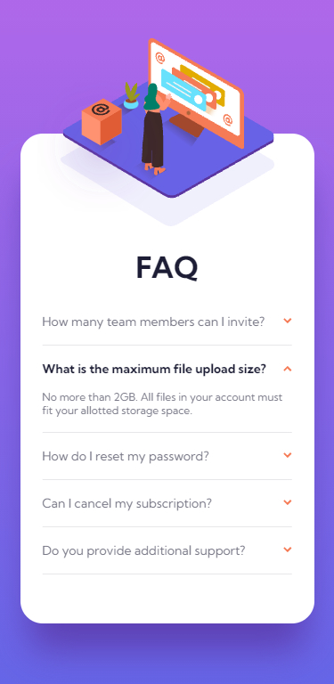
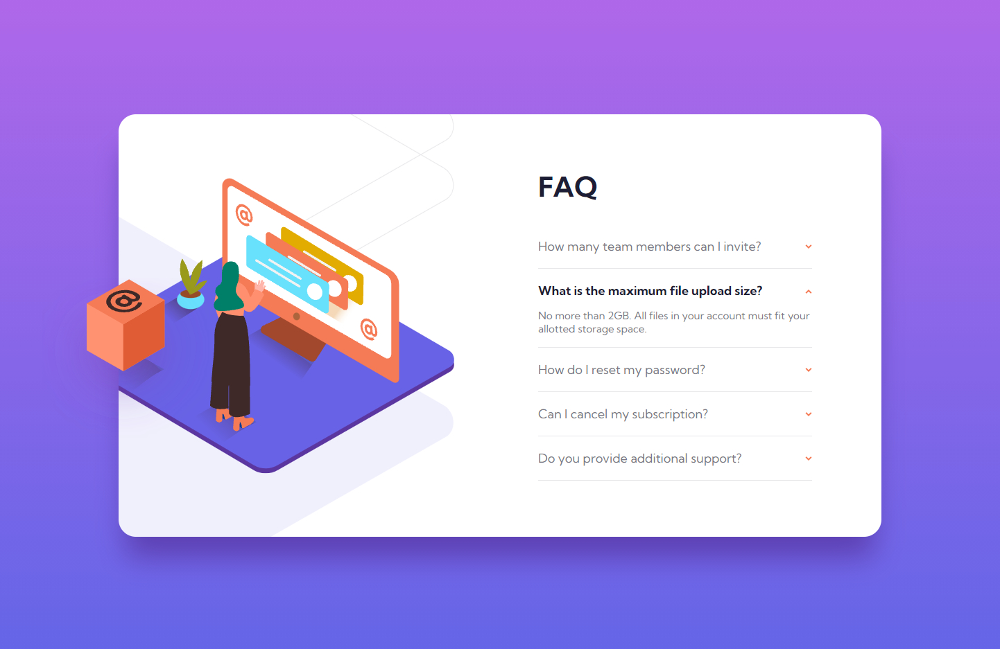

# Frontend Mentor - FAQ accordion card solution

This is a solution to the [FAQ accordion card challenge on Frontend Mentor](https://www.frontendmentor.io/challenges/faq-accordion-card-XlyjD0Oam). Frontend Mentor challenges help you improve your coding skills by building realistic projects. 

## Table of contents

- [Overview](#overview)
  - [The challenge](#the-challenge)
  - [Screenshots](#screenshots)
- [My process](#my-process)
  - [Built with](#built-with)
  - [What I learned](#what-i-learned)
- [Author](#author)

## Overview

### The challenge

Users should be able to:

- View the optimal layout for the component depending on their device's screen size
- See hover states for all interactive elements on the page
- Hide/Show the answer to a question when the question is clicked

### Screenshots





## My process

### Built with

- HTML
- SASS
- Flexbox
- JavaScript
- Mobile-first workflow

### What I learned

```html
<div class="ques" onmouseover="boxMove('-27%')" onmouseout="boxMove('-20%')">
```

```js
function boxMove(move) {
    box.style.left = move
}
```

## Author

- Frontend Mentor - [@aVantaci](https://www.frontendmentor.io/profile/aVantaci)
